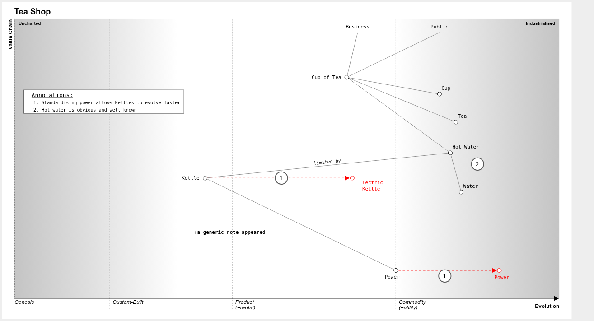

# go-wardley 

[go-wardley][] is a library that creates Wardley Maps using the syntax from and [OnlineWardleyMaps][] itself.

## CLI

The CLI is called `owm` as `go-wardley` is the library that can be embedded in other tools.

### Install


If you have [Homebrew](https://brew.sh) installed, you can run:

```shell
brew tap mrueg/homebrew-tap
brew install owm
```

Alternatively, you can download the [Release](https://github.com/mrueg/go-wardley/releases) or install via

```shell
go install github.com/mrueg/go-wardley/cmd/owm@latest
```

### Usage

```shell
NAME:
   owm - Render Wardley Maps on the command line

USAGE:
   owm [global options]

VERSION: $VERSION

GLOBAL OPTIONS:
   --port int, -p int          Port the internal communication runs on (default: random)
   --input string, -i string   Path to file that contains the Wardley Map (if unset, read from stdin)
   --output string, -o string  Path of the output file (default: map.svg / map.png)
   --format string, -f string  Output format. Possible values: svg, png (default: "svg")
   --scale float, -s float     For PNG output only, scaling factor of the rendered image (default: 1)
   --help, -h                  show help
   --version, -v               print the version
```

## Syntax

See [here](REFERENCE.md).

## Example

```wardleymap
title Tea Shop
anchor Business [0.95, 0.63]
anchor Public [0.95, 0.78]
component Cup of Tea [0.79, 0.61] label [-85.48, 3.78]
component Cup [0.73, 0.78]
component Tea [0.63, 0.81]
component Hot Water [0.52, 0.80]
component Water [0.38, 0.82]
component Kettle [0.43, 0.35] label [-57, 4]
evolve Kettle->Electric Kettle 0.62 label [16, 5]
component Power [0.1, 0.7] label [-27, 20]
evolve Power 0.89 label [-12, 21]
Business->Cup of Tea
Public->Cup of Tea
Cup of Tea->Cup
Cup of Tea->Tea
Cup of Tea->Hot Water
Hot Water->Water
Hot Water->Kettle; limited by
Kettle->Power

annotation 1 [[0.43,0.49],[0.08,0.79]] Standardising power allows Kettles to evolve faster
annotation 2 [0.48, 0.85] Hot water is obvious and well known
annotations [0.72, 0.03]

note +a generic note appeared [0.23, 0.33]

style wardley
```




## How it works

[go-wardley][] uses [chromedp][] to execute [OnlineWardleyMaps][] in a headless Chrome browser and is able to capture the SVG from source code and the PNG as a screenshot of the created Wardley Map.


## Maintenance 

The bundled nextjs export of the [OnlineWardleyMaps][] app can be updated with [update-owm.sh](scripts/update-owm.sh)

## License

- [go-wardley][]: MIT License
- [onlinewardleymaps][]: MIT License
- [chromedp][]: MIT License
 
## Credits

This package is heavily inspired and reusing code from [OnlineWardleyMaps][] and [mermaid.go](https://github.com/dreampuf/mermaid.go).

[go-wardley]: https://github.com/mrueg/go-wardley
[onlinewardleymaps]: https://github.com/damonsk/onlinewardleymaps
[chromedp]: https://github.com/chromedp/chromedp

